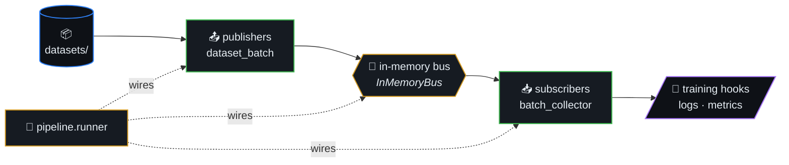
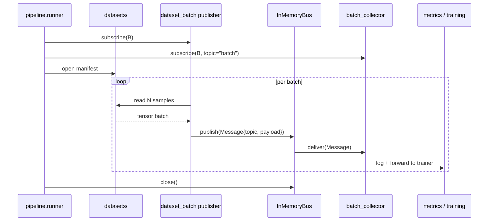
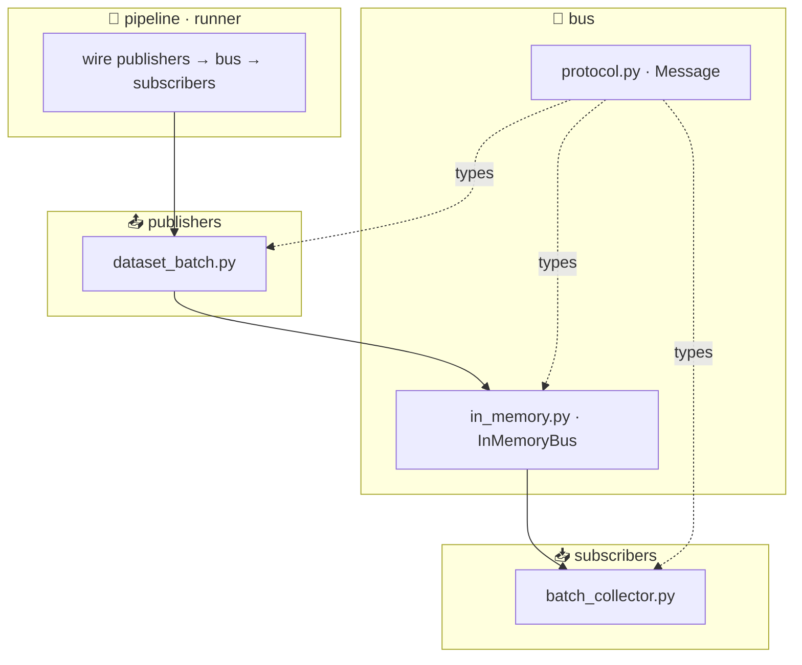
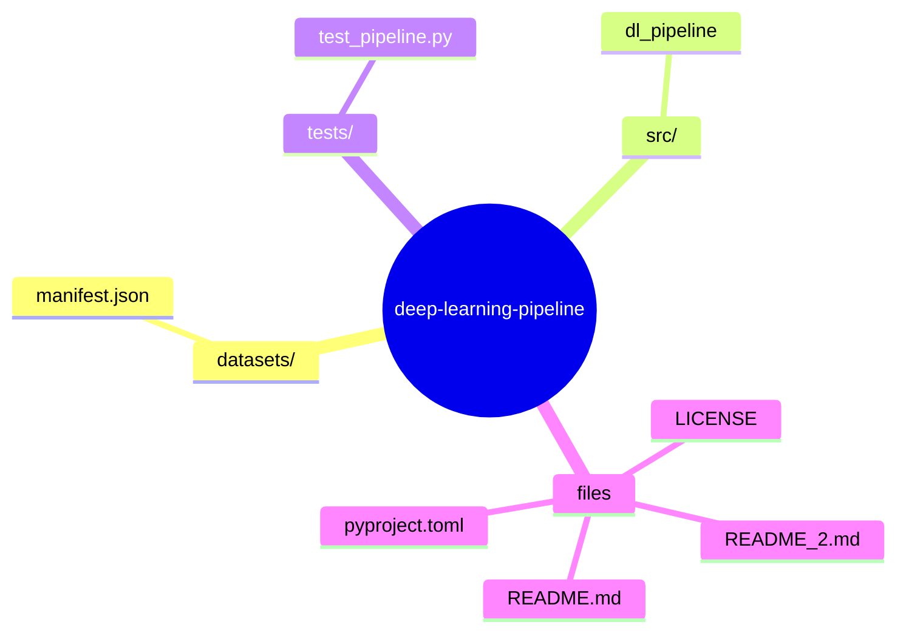

# deep-learning-pipeline

> Small **publisher → in-memory bus → subscriber** layout for dataset
> batching and training-side hooks. Same structural idea as a pub/sub
> data pipeline without requiring Kafka or Redis for local work.



## Table of contents

- [Layout](#layout)
- [Architecture at a glance](#architecture-at-a-glance)
- [Batch publish (sequence)](#batch-publish-sequence)
- [Quick start](#quick-start)
- [License](#license)
- [🗺️ Repository map](#️-repository-map)

## Batch publish (sequence)



## Layout

- `src/dl_pipeline/bus/` — message types and synchronous bus
- `src/dl_pipeline/publishers/` — dataset / batch producers
- `src/dl_pipeline/subscribers/` — sinks (logging, metrics, trainers)
- `src/dl_pipeline/pipeline/` — wiring and orchestration
- `datasets/` — manifests or references to real data locations

### Architecture at a glance



## Quick start

```bash
cd deep-learning-pipeline
python3 -m venv .venv && source .venv/bin/activate
pip install -e ".[dev]"
pytest
```

## License

MIT


## 🗺️ Repository map

Top-level layout of `deep-learning-pipeline` rendered as a Mermaid mindmap (auto-generated from the on-disk tree).


